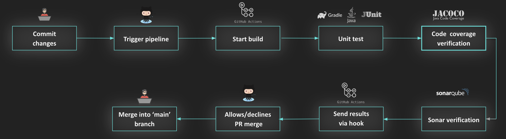
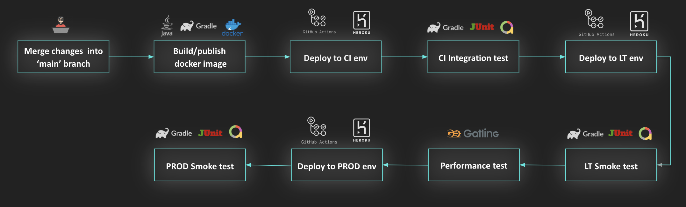

# Epl player service for pipeline
Reactive Back End service provides statistics about EPL football players 

## Tech
- Spring Web Reactive
- MySQL with reactive support
- Sonar Cloud
- Github Actions
- Heroku

## Environments
- CI: https://epl-players-ci.herokuapp.com/
- LT: https://epl-players-lt.herokuapp.com/
- PROD: https://epl-players.herokuapp.com/

## Open API documentation
- Open 'http://{server}:{port}/api-docs' to view documentation in JSON format for TDM service
```bash
http://localhost:8080/v3/api-docs
or
https://epl-players-ci.herokuapp.com/v3/api-docs
```
- Open 'http://{server}:{port}/swagger-ui.html' to view api endpoints for TDM service
```bash
http://localhost:8080/swagger-ui/index.html
or
https://epl-players-ci.herokuapp.com/webjars/swagger-ui/index.html
```

## Quality gate flow
<p align="left">
    
</p>

## Live env flow
<p align="left">
    
</p>

